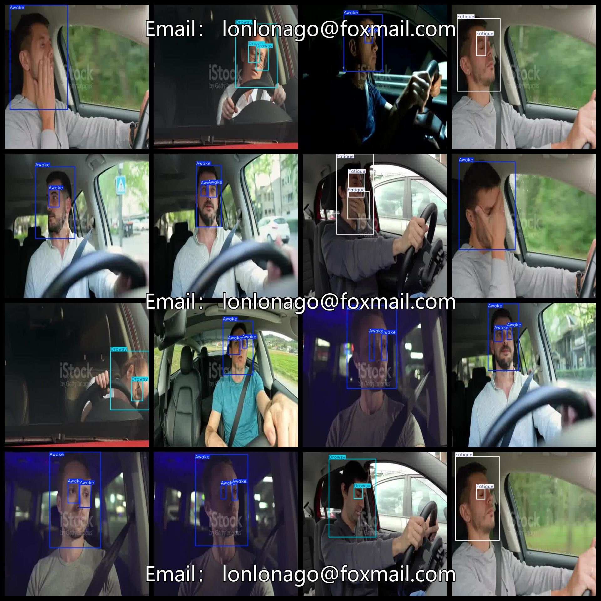
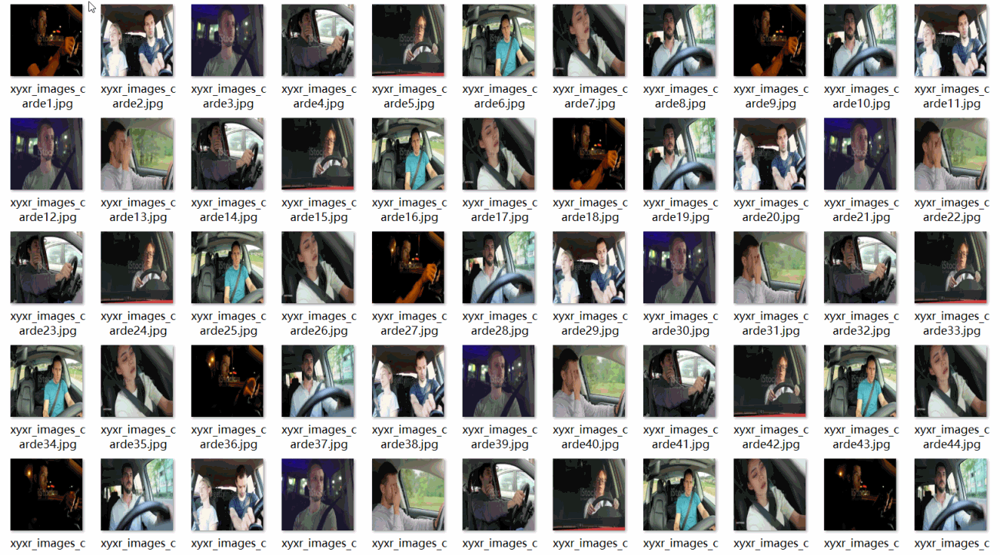

# [Object Detection] Driver fatigue Detection Dataset 711 imagesYOLO+VOC（(Augmented) ）

【Target Detection】Driver Fatigue Detection Dataset with 711 Images in YOLO+VOC (Enhanced)

Dataset Format: VOC format + YOLO format

The compressed file contains: three folders, each storing images, xml files, and text files.

Total jpg images in JPEGImages folder: 711

The XML files in the Annotations folder total: 711.

The total number of txt files in the labels folder is 711.

Number of tag types: 3

Tag names: ["Awake","Drowsy","Fatigue"]

The number of boxes for each label (Note that the order of labels in the Yolo format does not correspond to this, but is based on the classes.txt file in the labels folder):

Awake frame count = 1043

Drowsy frame count = 616

Fatigue frame count = 173

Total number of frames: 1832

Picture clarity (Resolution: Pixels): Clear

Image Enhancement: Yes

Shape of the label: Rectangular box, used for object detection and recognition.

Important Note: None

Special Notice: This dataset does not guarantee the accuracy or precision of the trained models or weight files. The dataset only provides accurate and reasonable annotations.

## Images

---

Here is a pay link on Stripe (https://buy.stripe.com/3cs8yP7sY87d0vu9AB). Please contact me lonlonago@foxmail.com after funding $89, and I will send you a complete data files, thank you!

